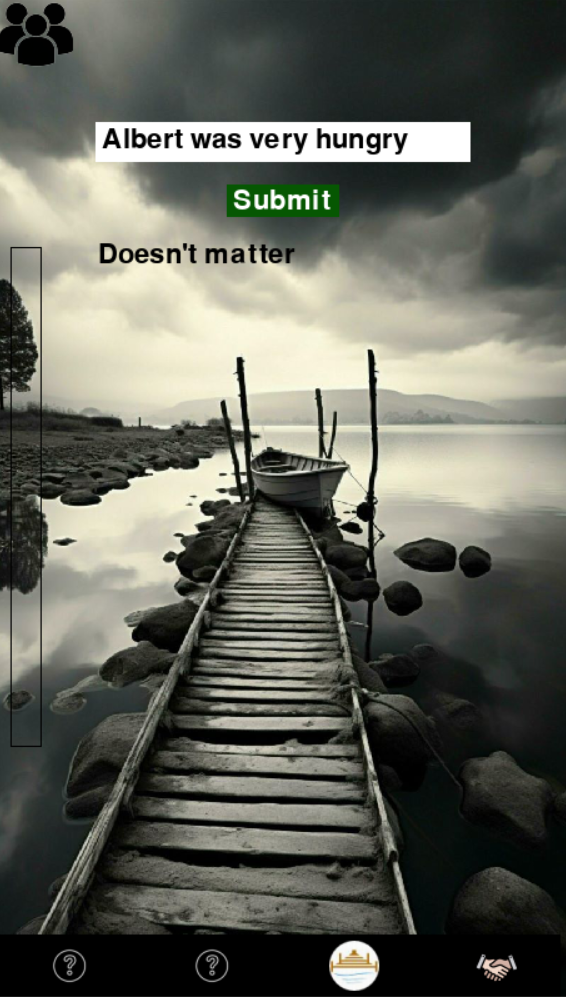
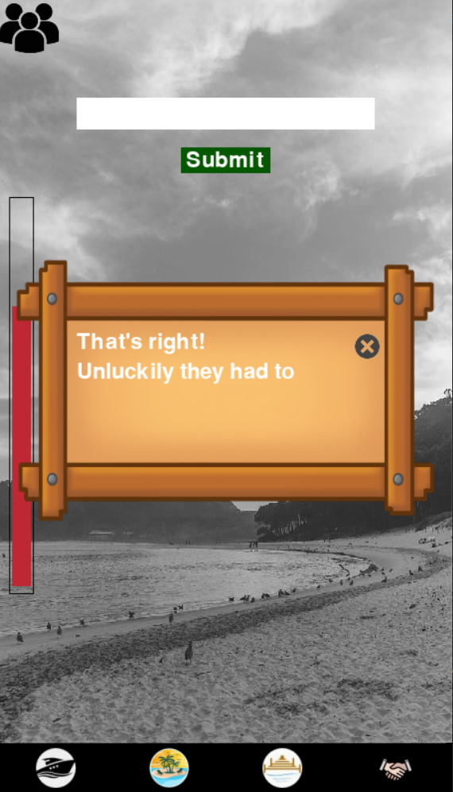
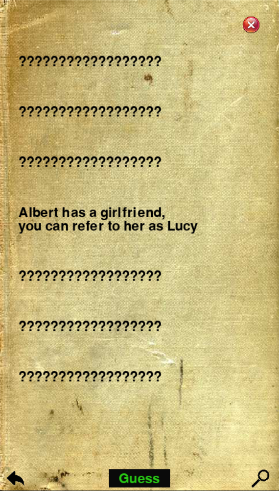
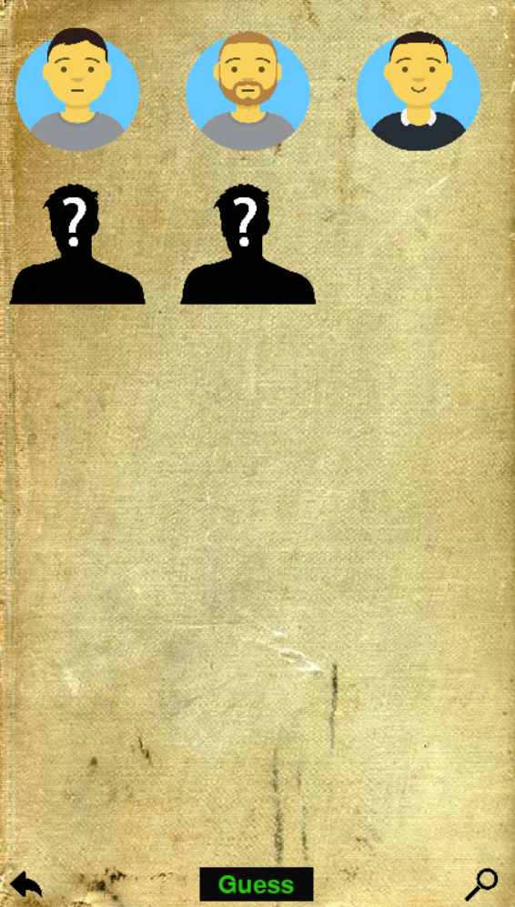
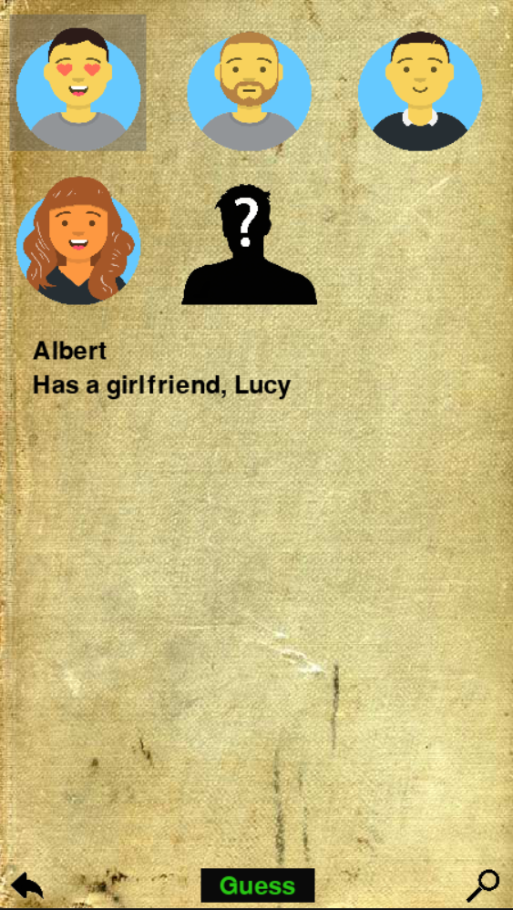
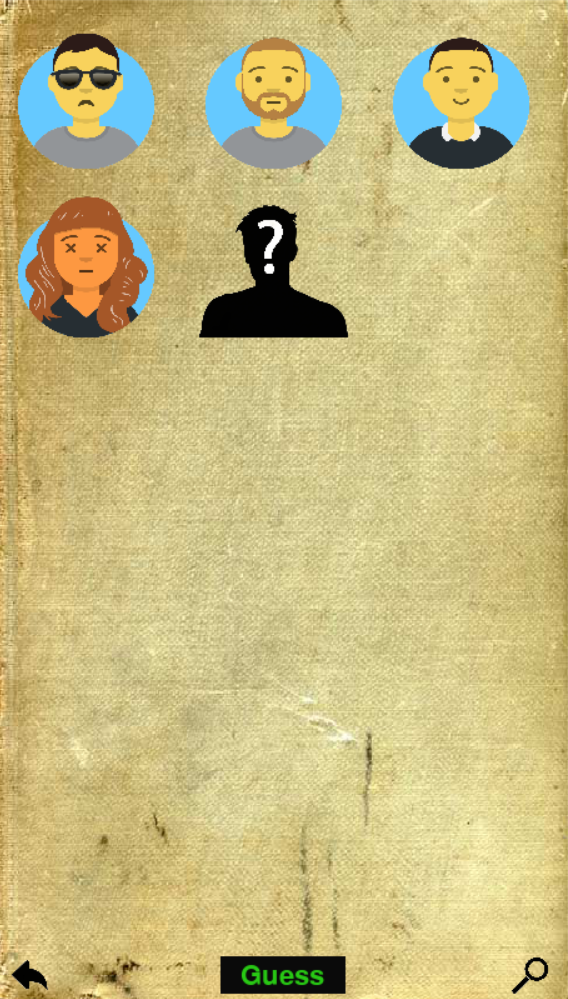

# 🌊 SeagullStory: AI-Driven Lateral Thinking Game

Can you solve the mystery of Albert's death? **SeagullStory** is a text-based detective game built in Pygame, powered by advanced Natural Language Processing (NLP) models. 

It is powered by a custom dual-LLM system to understand and answer any boolean (Yes/No) question you ask, as well as to guide you through the story with hints and unlocking scenarios.

---

## 🛠️ Architecture
This project uses a hybrid **Cloud API + Edge AI** architecture:

*   **Primary Model (Cloud API):** Powered by a **DeBERTa-v3** model fine-tuned on a custom dataset and hosted on Hugging Face Spaces. It processes complex scenario data to accurately answer user questions with "Yes", "No", or "Doesn't matter".
*   **Progress Tracker (Local Edge AI):** Powered by a highly compressed, quantized **xtremedistil** model converted to **TensorFlow Lite (TFLite)**. Weighing only **12.4MB**, this local model tracks player progress in real-time and gives hints.
*   **The NLI Trick:** Progression tracking is framed as a Natural Language Inference (NLI) task. The system checks if the user's question *entails* hidden key facts, dynamically unlocking new story scenarios as you get closer the truth.
*   
> 💡 **For more technical details** 
> Read the full [Technical Architecture & Model Training procedure](./Game/utils/Model).
---

## 🎮 The Game Mechanics
You are given the cryptic final paragraph of a story. To win, you must reconstruct the events leading up to Albert's death by asking natural language questions.  
The AI will respond with:
*   **"Yes"** — if your hypothesis is true in the scenario.
*   **"No"** — if it is false.
*   **"Doesn't matter"** — if your question is irrelevant to the story.

The story is broken down into **3 distinct, unlockable scenarios**. Discovering key facts in one scenario will allow you to progress and grant you access to the next scenario.

---

## ⚡ Quick Start

### Prerequisites
Make sure you have Python installed, along with TensorFlow (required for the local TFLite progress tracker) and Pygame.

### Installation
Clone the repository and run Game.py

## Screenshots

