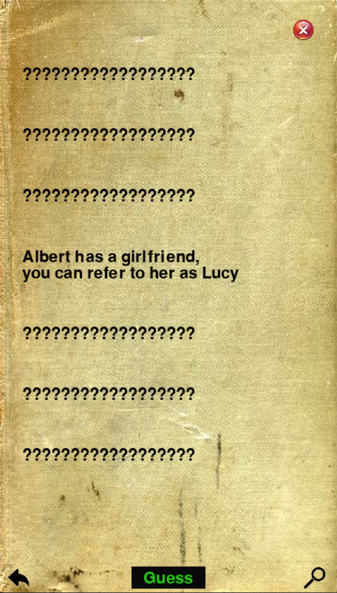
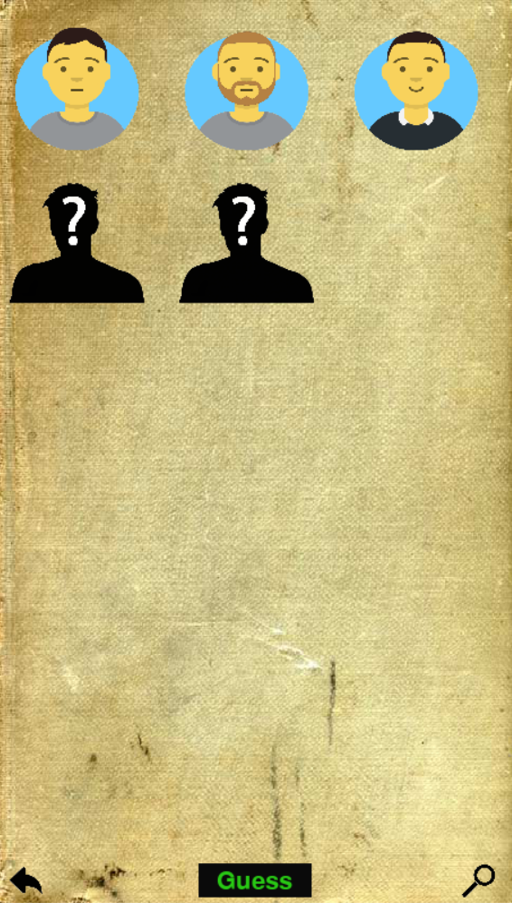

# SeagullStory
A text-based game where you have to unveil the mystery surrounding Albert's death. Developed in pygame.
## The game 
You are told the final part of a story. It does not make sense at first, but in the end you can be sure it will actually make sense.  
  
You can ask boolean questions to which you will receive one of the following answers: 
  
"Yes" if it is true  
"No" if it is not true  
"Doesn't matter" if what you're asking is not important to understand the whole story.  

Your goal is to find out about the rest of the story. To win the game, you have to explain the reasons behind Albert's death.  

The story is broken down into 3 different scenarios, each requiring unlocking before you can ask about Its events. Additionally, there are key facts scattered among these scenarios, that will be used for guidance and to track your progress.

## How to play  
Clone the repository and execute "Game.py". You will need Tensorflow installed on your machine.  

## How It works
The game processing is powered by two LLMs: one for answering, and one for tracking progress. You can find more technical details [here](https://github.com/manuu1311/SeagullStory/tree/main/Game/utils/Model)

## Screenshots

